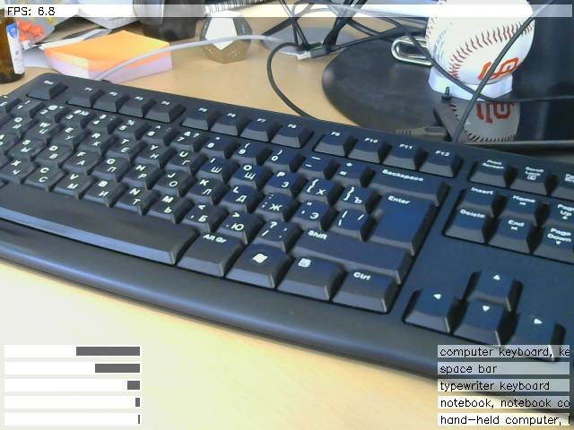

Image Classifier Demo
=====================

This application captures video stream from camera and outputs images captured into a window on a screen. At the same time it runs classifier for the captured images and overlays the results (Top-5 predictions) onto the original images.

Get model
---------

The app needs trained model to run the classifier. The models are stored at [Google Drive](https://drive.google.com/folderview?id=0B2hfQbOo3RqBR2IwYmozVTg4WnM&usp=sharing). Right now the only model is available - based on [ImageNet 2014](http://www.image-net.org/challenges/LSVRC/2014/) data, thus it is for non-commercial and educational purposes only.

Model files
-------------------

You need to download the archive with trained model and extract all the files from it:

	nnforge/
		working_data/
			image_classifier_demo/
				LICENSE
				class_names.txt
				normalizer_images.txt
				schema.txt
				trained_data/
					ann_trained_000/
						...multiple data files...

Config file
-----------

Check that .cfg file located in the same directory with executable has working_data_folder parameter pointing to image_classifier_demo directory from the tree structure above.

Running
-----------

Run the app, wait for the classifier to load the model. Enjoy!
